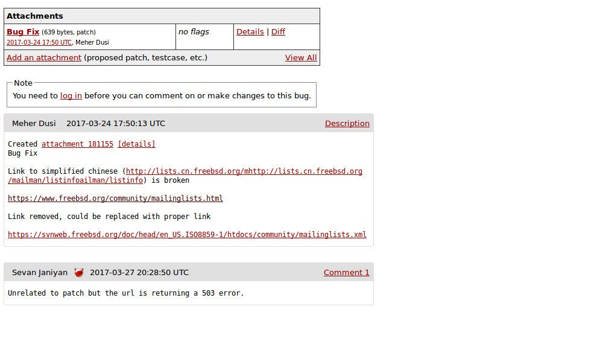

# lab8

I found a broken link for the simplified chinese language version on the 
[mailing list 
page](http://lists.cn.freebsd.org/mhttp://lists.cn.freebsd.org/mailman/listinfoailman/listinfo).

My patch involved deleting this broken link.

It is important to maintain good documentation, as this involves ease of 
use and allows other users to conceptually understand the function and 
inner workings of the code.

From this lab, I learned the importance of documentation, how to use SVN 
clients, and how to report bugs using bugzilla.
